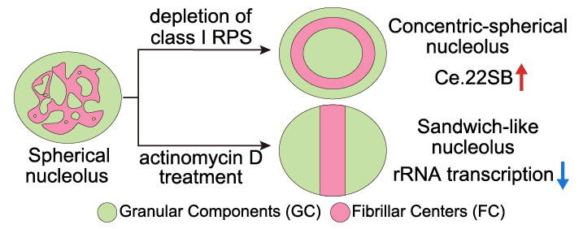

# 个人主页本地修改指南

## 目录结构

```
homepage/
├── index.html                  # 主页面（内容在这里改）
├── css/
│   └── academic.css            # 样式文件（颜色、字体、布局在这里改）
├── images/
│   ├── banner-images/
│   │   └── banner-image-1.jpeg # 首屏背景图
│   ├── gallery-images/         # 爱好板块的图片
│   ├── publication-images/     # 论文配图
│   └── resources-images/       # 资源板块的图片
├── protected/
│   └── cv_za.pdf               # 简历（密码保护）
├── resources/
│   └── palette.pdf             # 资源下载文件
└── fonts/ js/                  # 字体和脚本，一般不需要改
```

---

## 本地预览

修改文件后，在浏览器直接打开本地文件即可预览，**不需要安装任何服务器**：

```bash
open /Users/aozheng/Downloads/homepage/index.html
```

每次保存文件后，在浏览器按 `Cmd+R` 刷新即可看到最新效果。

> **注意：** 如果样式没有更新，按 `Cmd+Shift+R` 强制刷新（清除缓存）。

---

## 发布到 GitHub

本地改好、预览满意后，执行以下命令发布：

```bash
cd /Users/aozheng/Downloads/homepage

# 1. 暂存所有改动
git add -A

# 2. 提交（引号内写本次改了什么）
git commit -m "更新论文信息"

# 3. 推送到 GitHub
git push
```

推送后约 **30–60 秒**，网站自动更新，地址：https://ao0o0oz.github.io/

可以在 https://github.com/Ao0O0oZ/Ao0O0oZ.github.io/actions 查看部署进度。

---

## 常见修改场景

### 修改个人简介文字

打开 `index.html`，找到 `id="about"` 的 `<section>` 标签，修改其中的文字内容：

```html
<section id="about" class="section section-light">
    ...
    <p>修改这里的简介文字。</p>

    <ul class="interest-list">
        <li>修改或添加研究方向</li>
        <li>第二个研究方向</li>
    </ul>

    <div class="contact-info">
        <span><i class="fa fa-envelope"></i> 邮箱地址</span>
        <span><i class="fa fa-commenting"></i> WeChat: 微信号</span>
        <span><i class="fa fa-github"></i> <a href="https://github.com/用户名" target="_blank">github.com/用户名</a></span>
    </div>
    ...
</section>
```

---

### 添加一篇新论文

在 `index.html` 找到 `id="publications"` 的 `<section>`，在 `pub-list` 里复制以下模板并填入信息：

```html
<div class="pub-item">
    <div class="pub-content">
        <p class="pub-authors">作者1, <strong>Ao Zheng</strong>, 作者3, <em>et al.</em></p>
        <p class="pub-title">论文标题。</p>
        <p class="pub-journal"><em>期刊名称</em> &mdash; 年份</p>
        <span class="pub-badge">Co-first Author</span>
        <!-- 如果不是共同一作，改为: -->
        <!-- <span class="pub-badge pub-badge-prep">Co-author</span> -->
    </div>
    <!-- 有配图时放 img，暂无配图时留空 div 即可 -->
    <div class="pub-image">
        
    </div>
</div>
```

把论文配图放入 `images/publication-images/` 文件夹（文件名对应上面的 `pub_3.png`）。暂无配图时 `<div class="pub-image"></div>` 留空即可，右侧位置保留。

图片显示规则：等比缩放、不拉伸、在框内居中，手机端文字在上、图片在下。

**`pub-badge` 颜色说明：**

| class | 颜色 | 适用场景 |
|-------|------|----------|
| `pub-badge` | 蓝色 | 共同一作、通讯作者 |
| `pub-badge pub-badge-prep` | 金色 | 合作者、In preparation |

---

### 添加爱好图片

将图片文件放入 `images/gallery-images/`，然后在 `index.html` 找到对应的 `gallery-grid`，复制以下模板：

```html
<div class="gallery-item">
    
    <div class="gallery-caption">鼠标悬停时显示的说明文字。</div>
</div>
```

图片建议：
- 格式：`.jpg`（照片）或 `.png`（设计图）
- 尺寸：长宽相近（接近正方形），宽度 800px 以上
- 文件大小：压缩到 500KB 以下，避免页面加载慢

---

### 添加资源下载

将 PDF 或其他文件放入 `resources/` 文件夹，然后在 `index.html` 找到 `id="resources"` 的 `<section>`，在 `resource-grid` 里添加：

```html
<div class="resource-card">
    <div class="resource-image">
        
    </div>
    <div class="resource-info">
        <h4>资源标题</h4>
        <p>资源说明文字。</p>
        <a href="resources/新文件.pdf" class="btn-download" download>
            <i class="fa fa-download"></i> Download PDF
        </a>
    </div>
</div>
```

---

### 更换首屏背景图

将新图片放入 `images/banner-images/`，然后打开 `css/academic.css`，找到以下代码并修改文件名：

```css
.hero {
    background: url('../images/banner-images/新图片.jpg') center center / cover no-repeat;
}
```

背景图建议：风景或抽象图，宽度 1920px 以上，文件大小 1MB 以下。

---

### 修改颜色主题

打开 `css/academic.css`，文件顶部的 `:root` 定义了全站颜色变量，修改这里即可全局生效：

```css
:root {
    --navy:       #1a2744;  /* 深色标题、导航栏 */
    --blue:       #2a6496;  /* 链接、论文边框、下载按钮 */
    --blue-light: #3a7cbd;  /* 按钮悬停色 */
    --accent:     #c69c4a;  /* 金色强调色（分割线、徽章） */
    --text:       #2c2c2c;  /* 正文颜色 */
    --text-muted: #666;     /* 次要文字（作者、期刊） */
    --bg:         #f8f7f4;  /* 奇数区块背景（米白） */
    --bg-alt:     #ffffff;  /* 偶数区块背景（纯白） */
    --border:     #ddd;     /* 边框颜色 */
}
```

---

### 更新简历（CV）

直接替换 `protected/cv_za.pdf` 文件，文件名保持不变，密码不变。

如需修改密码，需要将新密码的 SHA-256 哈希值替换到 `index.html` 顶部的 `correctHash` 变量。可以用以下命令生成哈希：

```bash
echo -n "新密码" | shasum -a 256
```

---

### 修改导航栏链接

打开 `index.html`，找到 `<ul class="nav-links">` 修改链接文字或目标：

```html
<ul class="nav-links" id="navLinks">
    <li><a href="#about">About</a></li>
    <li><a href="#publications">Publications</a></li>
    <li><a href="#hobbies">Hobbies</a></li>
    <li><a href="#resources">Resources</a></li>
    <li><a href="javascript:void(0)" onclick="checkPassword()" class="nav-cv">Résumé</a></li>
</ul>
```

`href="#about"` 对应页面中 `id="about"` 的区块，点击会自动滚动过去。

---

## Git 常用命令速查

```bash
# 查看有哪些文件被修改了
git status

# 查看具体改动内容
git diff

# 只提交某个文件
git add index.html
git commit -m "更新简介"
git push

# 提交所有改动
git add -A
git commit -m "描述"
git push

# 查看提交历史
git log --oneline

# 撤销本地未提交的改动（危险！改动会丢失）
git checkout -- index.html
```

---

## 网站地址

- **线上地址：** https://ao0o0oz.github.io/
- **GitHub 仓库：** https://github.com/Ao0O0oZ/Ao0O0oZ.github.io
- **部署状态：** https://github.com/Ao0O0oZ/Ao0O0oZ.github.io/actions
